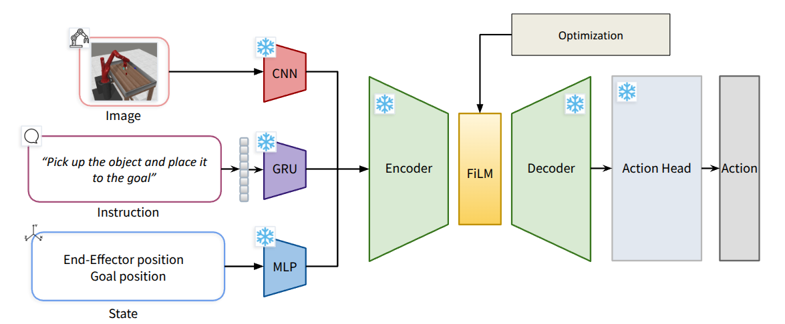

# VLA via FiLM


## Overview
Pre-trained VLA policies are powerful, but they are not perfect. Retraining is one solution, but it is costly and time consuming.  
Can FiLM layer be enough to fix a failing policy and enable cross-task, cross-embodiment adaptation?

## VLA Architecture
- FiLM layer is applied at the 16 dims bottleneck
- Only the FiLM params are updated, all pretrained VLA weights are kept frozen  



## Setup

Create a Python environment first.
```bash
conda create -n vla_film python=3.10
conda activate vla_film
```

Clone this repository
```
git clone https://github.com/knamatame0729/Steering-VLA-via-FiLM.git
cd Steering-VLA-via-FiLM
```
Install dependencies
```
pip install -r requirements.txt
```  


## Collect demonstration data
[Robomimic Documentation](https://robomimic.github.io/docs/datasets/robomimic_v0.1.html)  

```
python -m robomimic.scripts.download_datasets --tasks can --dataset_types ph --hdf5_types raw --download_dir ~/Steering-VLA-via-FiLM/data
```

## Postprocessing
Check [robomimic](https://github.com/ARISE-Initiative/robomimic/blob/master/robomimic/scripts/dataset_states_to_obs.py)
## Checkpoints
Make a directory for checkpoints
```
mkdir ~/Steering-VLA-via-FiLM/checkpoints
```

### Checkpoint for metaworld Pick and Place Task in Metaworld
Download checkpoints from [here](https://wandb.ai/kaitos_projects/Manual_FiLM_VLA_Testing/artifacts/model/fm_bottleneck_model/v0/files)


## Train

Train on a robomimic dataset and save a checkpoint:

```bash
python -m scripts.train_robosuite --dataset-path /path/to/your_dataset.hdf5 --save-path checkpoints/model.pt --device cuda --batch-size 64 --epochs 50
```

## Evaluate

Run a trained checkpoint in robosuite:

```bash
python -m scripts.eval_robosuite --checkpoint checkpoints/can_model_v2.pt --env-name PickPlaceCan --robot Panda --controller OSC_POSE --device cuda --episodes 10 --save-video
```

## FiLM Optimization

Search optimal FiLM params.

```bash
python -m scripts.optimize_film_params --checkpoint checkpoints/can_model_v2.pt --device cuda --eval-episodes 10 --ng-budget 2000
```

## Manual FiLM runs

Apply fixed optimal FiLM params overrides and evaluates them.

```bash
python -m scripts.manual_film_layer --checkpoint checkpoints/can_model_v2.pt --device cuda --episodes 100 --save-video
```

## Props
```bash
export MODEL_SOURCE=/path/to/model
python -m scripts.llm_film_optimize --device cuda --episodes 400 --save-video --prompt-id 4 --eval-episodes 10
```